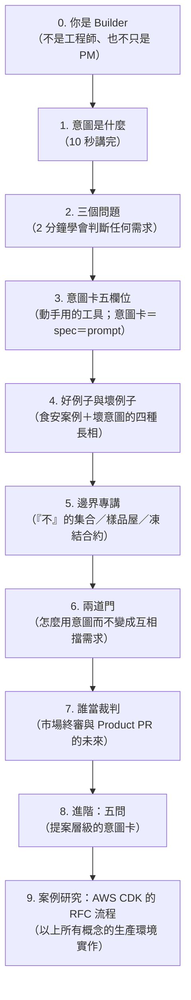

# 產品意圖與意圖邊界（Product Intent Map）

**給所有 Builder 的共用教材。** 這份文件回答三個問題：你在 AI 時代的角色是什麼？什麼是一個「完整的產品意圖」？意圖的「邊界」是什麼、怎麼定？

**整份文件的閱讀路線（就是這張圖）：**

---

## 0. 先重新介紹一下你自己：你是 Builder

> 來自一位外部資深 Builder 的回饋（Pahud Hsieh，2026-07-23）：
> 「我會寫 **Builder** 而不是工程師——工程師是很刻板印象的概念。現在 Builder 模糊了工程師與 PM 的界線。我會希望 Builder **同時站在產品角度與工程角度**思考。」

我們採用這個說法。在 AI 時代，「寫程式的人」和「寫需求的人」的分界正在消失：AI 把執行的成本壓到地板之後，剩下的工作就是**決定做什麼（產品眼）**和**驗收做得對不對（工程眼）**——而這兩隻眼睛必須長在同一個人身上。這個人就叫 Builder。

這也是為什麼這份文件不是「給 PM 的」或「給工程師的」——**意圖是 Builder 的產品眼，驗收與邊界是 Builder 的工程眼。** 兩隻眼睛，一份教材。

---

## 1. 意圖是什麼（10 秒版）

> **意圖**：「這個東西做完之後，世界上有什麼事情會變得不一樣？」
>
> **邊界**：「展示不出來的，就是還沒決定的。」

如果只能記一句話，記這句：

> 「別用文件描述你要的產品——做給我看。你能展示的就是你決定了的；你展示不出來的，就是你還沒想清楚的。」

---

## 2. 三個問題（2 分鐘學會判斷任何需求）

意圖不是「要做什麼功能」，而是一個**可以被驗證的主張**。把任何需求壓縮成三個問題，誰都聽得懂，誰都能拿去判斷任何需求：

1. **做什麼？** —— 這個東西會讓誰的什麼行為改變？
2. **不做什麼？** —— 我們刻意不碰哪些東西？（說出三到五條）
3. **怎麼知道成了？** —— 動手之前就先寫下來：看到什麼訊號，我們才承認它成功了？

**邊界就藏在第二題和第三題裡。** 第二題是邊界的宣告，第三題是邊界的驗收條件。一個從來不拒絕任何東西的需求，等於沒有邊界；沒有邊界的需求，做的人只能用猜的，猜錯了就重做——這就是那些開不完的「對齊會議」的真正來源。

---

## 3. 意圖卡：動手用的工具（五個欄位）

一個意圖「完整」（注意：是「完整」，不是「好」——這個區別是整套方法的核心），指的是五個欄位每一格都能用兩句話以內回答：

| 欄位 | 問題 | 沒填好的樣子 |
|---|---|---|
| 誰的問題 | 誰在痛？叫得出名字嗎？ | 「使用者」「大家」 |
| 改變什麼 | 哪個看得到的行為或數字會動？ | 「體驗更好」 |
| 成功訊號 | 動手前就寫下：怎麼知道成了？ | 「上線就算完成」 |
| 不做會怎樣 | 不做的代價是什麼？ | 答不出來（那本身就是優先序的訊號） |
| 邊界 | 什麼不能壞？什麼刻意不做？期限？ | 「都要」「越快越好」 |

**Builder 最重要的一句話：**

> 「這五格答完，你的 prompt 就寫完了。答不完，你就只能一直坐在螢幕前面用自動補全。**意圖卡就是 spec，spec 就是 prompt。**」

這就是產品眼和工程眼在同一張卡上會合的地方：前四格是產品眼填的，第五格和驗收是工程眼盯的。

---

## 4. 好例子與壞例子

### 好意圖長什麼樣：食安功能

- 任務版說法：「做一個食安查詢功能。」
- 意圖版說法：「發票載具的用戶（誰）在食安新聞爆發時查不到自己買過的東西有沒有中標（痛）；做完之後，用戶能在 30 秒內從自己的發票裡查出風險品項（改變什麼）；上線一週內的使用率和分享率是成功訊號（怎麼知道成了）；我們不做廠商申訴後台、不做即時新聞牆（不做什麼）；法規風險有具名的承擔者，這是動工前就寫下的邊界條件（邊界）。」
- 值得記住的一課：同類產品往往遲遲沒有跟進這種功能，不是因為技術做不出來，而是他們的**邊界**不允許。**邊界常常不是技術問題，是意圖問題。**

### 壞意圖的四種長相（描述性的，不針對任何人）

1. **沒有成功訊號**：「把它做好一點。」——無法被驗證，所以無法被交付，也無法委派給 AI。
2. **借來的權威**：「老闆要的。」——意圖不在你手上。這個需求不是不合法，是**不完整**：回到源頭把五格問完。（任何層級都適用。）
3. **偽裝成解法**：「加個 Redis cache。」——直接指定實作。反問它解決什麼問題——cache 可能真的是對的！但現在它變成可驗證的了。
4. **無邊無際**：「持續優化。」——沒有終點訊號，沒有邊界，做的人永遠不知道什麼時候算完。

---

## 5. 邊界專講（三個講法，看對象挑一個）

**講法一（給所有人）：邊界是「不」的集合。**
一個產品的邊界，就是它對哪些事情說了「不」。從來不說「不」的產品沒有形狀。所以檢查一個需求有沒有邊界，只要問一句：「**這個需求拒絕了什麼？**」答不出來，就是沒有邊界。

**講法二（給產品眼）：樣品屋。**
沒有人買房子是讀建築規格書買的——大家走進樣品屋。樣品屋同時做了兩件事：讓你看到你會得到什麼，也讓你看到你**不會**得到什麼（樣品屋沒有的，合約裡就沒有）。MVP 就是產品的樣品屋。

**講法三（給工程眼）：凍結的合約。**
第一輪評審把意圖和範圍**凍結成合約**；之後任何人要擋這個變更，必須拿出「違反了凍結合約」的證據，不能重新開品味辯論。邊界的意義就是：**它讓後面所有的爭論都有一個裁判標準。** 沒有凍結的邊界，每一次會議都是重新發明產品。

**邊界從哪裡來？三個來源：**
- **宣告的**——「不做什麼」清單；
- **累積的**——每一次「我們選了 A 不選 B」的決策記錄，都是一塊界碑；
- **發現的**——每一次市場測試的結果，都畫出一個文件寫不出來的邊界點。

**邊界打架的時候怎麼辦？** 一個真實案例：想在既有的高流量版面新增分析欄位，動哪裡都會撞到舊用戶的習慣——這就是新意圖撞上舊產品的邊界。答案不是開更多協調會，而是**解耦**：新開一個獨立的新入口，新想法直接在新邊界裡上架，舊系統一根汗毛都不動。**邊界衝突的解法往往不是談判，是重劃。**

---

## 6. 兩道門（怎麼用意圖，而不變成互相擋需求）

學會意圖之後最容易出的亂子：拿「你沒有意圖」互相擋需求。所以規則必須跟工具一起教：

- **A 門：完整性。** 描述性的、二元的，任何人都可以檢查。收到需求的人只有一個合法動作：**把缺的欄位問出來**。「因為沒有意圖所以我不做」是被禁止的句型。可以這樣說：「我不是在擋你，我是在幫這個需求把它自己補完——五格補完，我做得又快又對。」
- **B 門：值不值得。** 品味的、看情境的、有主人的。「這是不是十倍好的種子、現在該不該做」由決策負責人判斷，不是收需求的人在門口判。**品味吵不出結果的時候，不要開會辯論——把測試變便宜，讓市場回答。**

一句話收束：**收需求的人管 A 門，決策負責人管 B 門，市場當終審。**

### 常見反對意見與回應

| 常聽到的說法 | 回應 |
|---|---|
| 「這是官僚流程，增加負擔。」 | 「五個欄位、兩句話一格，比任何一場對齊會議都短。它取代的是會議，不是疊加在會議上。」 |
| 「很急，沒時間寫意圖。」 | 「越急越要寫——五格寫完 AI 直接開工，比口頭交代然後重做三次快得多。急件最怕的就是快速地做錯。」 |
| 「你憑什麼判斷我的意圖好不好？」 | 「我不判斷。A 門只檢查完整不完整；值不值得是決策負責人和市場的事。我只會問你缺的那幾格。」 |
| 「MVP 會被當成架構抄。」 | 「MVP 是意圖的表達，不是架構的表達——這句話每次交付都講一遍，寫在意圖卡最下面。」 |
| 「demo 展示不了合規、資安這些看不見的東西。」 | 「對，所以規則是 demo＋三個答案，永遠不是 demo 單獨出現。『不做什麼』那三五條，就是接看不見的東西的。」 |

---

## 7. 誰當裁判：市場終審與 Product PR 的未來

不需要統一大家的品味，需要統一**被判斷的物件**。十個人讀同一份 PRD，其實是在評十個各自想像出來的產品；十個人點同一個 MVP，是在對同一個真實的東西吵架——而這種吵架是有生產力的，因為它可以用一個便宜的測試收場，不需要再開一場會。

所以未來的交付形狀是：

- 傳統流程：PRD → 開會對齊 → 執行 → 再開會 → 再對齊 → ……
- 新流程：**能動的 MVP（diff）＋ 意圖卡（PR body）＋ 心智圖等輔助材料 → 評審（五問）→ 市場（上線驗證）**

全公司一個心智模型：**每個 Builder 交付的都是一個 PR**——內容都是「能動的東西＋簡短的意圖＋不做什麼」。AI 已經把 MVP 的成本壓到幾小時的等級，這件事幾年前做不到，現在做得到。這也正是 Builder 模糊工程師與 PM 界線的原因：當交付物長得一樣，角色的分界自然消失。

---

## 8. 進階：五問（5-Ask）——提案層級的意圖卡

當要評的不是一個需求、而是一個完整的提案（PR、設計文件、產品決策）時，用五問：

1. **解決什麼問題？** —— 問題是真的嗎、範圍清楚嗎、現在值得解嗎？
2. **考慮過什麼替代方案？** —— 解法空間被探索過，還是第一個想法就出貨了？
3. **怎麼解決？** —— 機制站得住嗎？有沒有隱藏的複雜度？
4. **有什麼限制與風險？** —— 已知的失敗模式、範圍邊界、資料風險。
5. **是最佳方案嗎？** —— 在真實限制下，這是不是最輕的可行解？它刻意不優化什麼？

五問和意圖卡是同一個東西的兩個尺度：**意圖卡管「需求進門」，五問管「提案出門」。** 五問只有在意圖與邊界存在的前提下才有牙齒——不然它只能檢查一個提案「自圓其說」，而一個論證漂亮、意圖錯誤的提案，是會通過自圓其說檢查的。

---

## 9. 案例研究：這一切在世界級團隊怎麼跑

**[AWS CDK 的 RFC 流程 —— 動工之前先想清楚，並且找一個更資深的人對齊](case-rfc-bar-raiser.md)**

一份真實的 RFC（CDK Comprehensive Validation）的完整拆解：Working Backwards（先寫上線那天的公告）＝意圖的樣品屋；Bar Raiser＝B 門的人形化；API Sign-off＝凍結合約；否決權只限不可逆的部分＝審查強度跟著不可逆性走。外加：為什麼 AI 時代這個流程更重要而不是更不重要，以及我們可以借用的最輕三條規則。

---

*v1.2 — 2026-07-24。變更：新增 RFC/Bar Raiser 案例研究（感謝 Pahud Hsieh 分享）。v1.1 — 2026-07-23。變更：採納 Builder 框架（感謝 Pahud Hsieh 的回饋）；全文重排為單一閱讀路線（你是誰 → 意圖 → 工具 → 例子 → 邊界 → 規則 → 裁判 → 進階），開頭新增總覽圖。歡迎直接引用、轉發、拿去教。*
