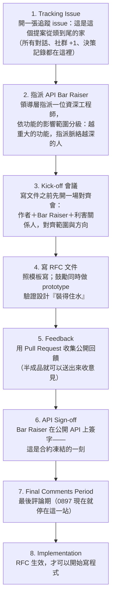

# 案例研究：AWS CDK 的 RFC 流程 —— 動工之前先想清楚，並且找一個更資深的人對齊

> 本文是 [產品意圖與意圖邊界](README.md) 的配套案例。前面講的意圖卡、邊界、凍結合約、兩道門，在這裡可以看到一個世界級團隊的**生產環境實作**。

## 0. 為什麼看這個案例

一位在 AWS 的資深 Builder（Pahud Hsieh）分享了他們團隊剛推出 CDK Validation 功能的流程：

> 「作者開始寫 code 之前要寫這個（RFC）出來，然後要有一個更資深的 engineer 做 bar raiser review 之後 sign off，這個 RFC 才會生效，你才可以開始 implement。
> **現在有 AI 了，寫這個很快，但 RFC/ADR 流程強迫 Builder 動工之前想清楚，並且有另一個資深工程師也在這個 loop 裡面對齊。**」

注意最後那句話——它回答了一個大家一定會問的問題：「AI 都能秒寫文件了，還要這種流程幹嘛？」答案是：**這個流程從來就不是為了產出文件，是為了強迫思考、並且在動工前讓第二顆資深的腦袋進入迴路。寫的成本歸零了，想清楚的價值一分沒少。**

RFC 原文：[aws/aws-cdk-rfcs #0897 — CDK Comprehensive Validation](https://github.com/aws/aws-cdk-rfcs/blob/main/text/0897-cdk-comprehensive-validation.md)

---

## 1. 這個流程怎麼運作（八個階段）

三個容易漏看、但最有含金量的設計：

1. **先開會、再寫文件**（第 3 站在第 4 站前面）。他們的原話：「我們的經驗顯示，這樣一場會可以省下大量的時間與精力。」——對齊發生在投入之前，不是之後。
2. **Bar Raiser 的否決權有精確的邊界**：他只對**公開 API** 有否決權（命名、結構、選項、CLI 指令），因為 API 一旦發佈就是「單向門」（one-way door）——改了就是 breaking change。至於技術方案本身？普通的 PR 評審就夠了，不需要 Bar Raiser 批准。這就是整個流程最漂亮的一條原則：**審查的強度，跟著不可逆的程度走。可逆的部分輕審，不可逆的部分重審。**
3. **鼓勵邊寫 RFC 邊做 prototype**——「好的 RFC 是深入細節的 RFC」。文件與可動的東西並行，不是二選一。（眼熟嗎？這就是我們的「MVP＋意圖卡，永遠不是其中之一單獨出現」。）

---

## 2. 拆解一份真的 RFC：#0897 CDK Comprehensive Validation

功能本身一句話：把 CloudFormation 部署時才會爆的錯誤「左移」到本機開發階段就抓到（三層防線：合成時的 library 檢查 → **合成後的離線驗證（新）** → 部署前的線上驗證），統一成一個 `cdk validate` 指令。

但真正值得學的是**文件的第一節**。它不是需求描述，是一篇**虛構的、寫著未來日期的部落格發佈文**：

> 「*April 1, 2026 · AWS CDK Team——今天，我們宣布推出 CDK Comprehensive Validation……*」

這是 Amazon 的 Working Backwards 方法：**先寫出「功能已經上線那天」的對外公告，再回頭做它。** 寫不出那篇公告，代表你還不知道自己要做什麼、為誰做、他為什麼會在乎——這就是「意圖的樣品屋」的純文字版本。展示不出來的，就是還沒決定的；**連虛構的發佈文都寫不出來的，就是還沒想清楚的。**

文件接下來的結構同樣照著「先對外、再對內」排：

- **Public FAQ**：我們在發佈什麼？用戶為什麼要用？
- **Internal FAQ**：為什麼做？**為什麼不該做？**（風險：合成時間變慢、誤報）考慮過哪些替代方案？（四個，每個都寫了否決理由）缺點是什麼？（三個，含「我們願意吃下 1 秒的時間代價與 50MB 的體積代價」這種明碼標價的取捨）專案計畫？（四個階段）

---

## 3. 用五問讀 #0897（五問 ↔ RFC 章節的對照）

| 五問 | RFC 對應章節 | #0897 的實際內容 |
|---|---|---|
| 1. 解決什麼問題？ | Working Backwards 部落格文＋Why are we doing this | 部署失敗的回饋太慢，人和 AI Agent 都被打斷；把錯誤左移到本機，`cdk validate` 成為 agentic workflow 驗證工作的一站式入口 |
| 2. 考慮過什麼替代方案？ | What alternative solutions did you consider | 四個替代方案，每個附否決理由：只靠 CFN 早期驗證（太晚）、多寫 library exception（跑步機、L1 用戶吃不到）、驗證邏輯放 library（10MB／600-1000ms 啟動成本的權衡）、用 TS 寫自訂規則（先做簡單版） |
| 3. 怎麼解決？ | Technical design | 三層防線＋離線驗證引擎＋抑制機制＋自訂規則＋遙測 |
| 4. 有什麼限制與風險？ | Why should we NOT do this＋Drawbacks | 合成時間 +1 秒、誤報風險（用抑制機制當安全毯）、與既有 Policy Validation 的重疊、+50MB 體積 |
| 5. 是最佳方案嗎？ | 散落在取捨的明碼標價裡 | 「我們願意吃下約 1 秒的時間代價來換取合成期驗證；如果代價不在這個量級，就必須提供退出機制」——最佳不是完美，是**寫清楚刻意不優化什麼、超過什麼界線就回頭** |

結論：**RFC 模板就是一台五問機器。** 作者不是「順便」回答了五問——模板的結構強迫他非答不可，而 Bar Raiser 的簽字讓答案有了裁判。

---

## 4. 心智模型：這個流程在我們的地圖上是什麼

| AWS 的機制 | 我們地圖上的概念 |
|---|---|
| Working Backwards 部落格文 | 意圖的樣品屋（MVP-as-PRD 的文字版）：先寫「上線那天」的公告 |
| RFC 文件本身 | Product PR 的 body：意圖卡＋五問的完整版 |
| Tracking Issue | 決策記錄（Decision Log）：提案從頭到尾的家 |
| Kick-off 會議 | A 門的協作版：動工前把五格一起補完 |
| API Bar Raiser | **B 門的人形化**：值不值得、擋不擋，有一個具名的資深負責人，不是門口任何人都能判 |
| API Sign-off | **凍結合約**：簽字之後意圖與範圍生效，之後要擋需要證據，不能重開品味辯論 |
| 否決權只限公開 API | **審查強度跟著不可逆性走**：單向門重審，雙向門輕審 |
| 邊寫 RFC 邊做 prototype | demo＋文件並行，永遠不是其中之一單獨出現 |

---

## 5. AI 時代，這個流程更重要，而不是更不重要

反直覺但重要：AI 把「寫 RFC」的成本壓到接近零之後，這個流程的價值反而**上升**了。原因有三：

1. **寫的成本歸零，想的成本沒有。** 流程的產出從來不是那份 markdown，是被強迫發生的思考。AI 可以幫你把想清楚的東西寫快十倍，但它替你想不清楚你自己的意圖——五格還是得你自己填。
2. **執行越快，方向錯誤越貴。** 當 AI 讓你一天寫完過去一個月的 code，「先想清楚再動工」省下的就不是一個月的返工，而是十個一天——而且錯誤的東西會更快地上線、更快地變成單向門。
3. **第二顆資深的腦袋，是 AI 給不了的東西。** Bar Raiser 帶進迴路的不是檢查力（AI 也會檢查），是**更長的脈絡與更寬的品味**——「這個 API 十八個月後會不會後悔」這種判斷，靠的是資歷裡的傷疤。

---

## 6. 如果我們要借用（最輕的版本）

不需要照搬八站。最小可行的移植是三條規則：

1. **超過三天的工作，動工前交一頁 RFC**：一張意圖卡（五格）＋五問各一段。AI 輔助之下，這是 30 分鐘的事。
2. **每份 RFC 指派一位資深 Builder 當 Bar Raiser**：他只對**不可逆的部分**有否決權（對外介面、資料結構、用戶可見的行為、合規邊界）；可逆的部分普通評審就好。簽字即凍結——之後要改，拿證據來。
3. **開頭永遠是 Working Backwards**：先寫「上線那天」的公告或截圖級 mockup。寫不出來，回到第一格。

---

*v1 — 2026-07-24。配套教材；感謝 Pahud Hsieh 分享流程與案例。*
